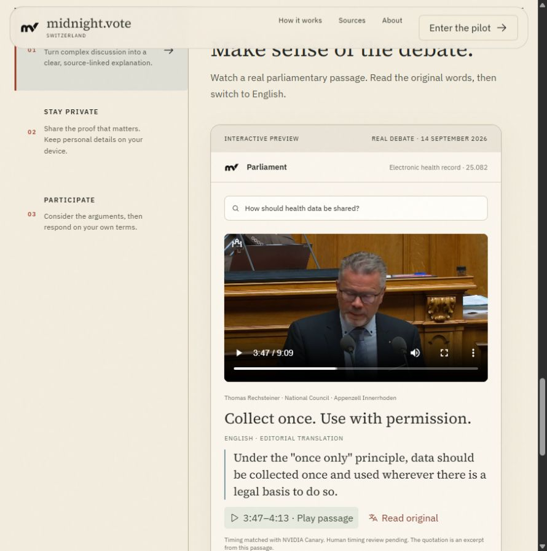
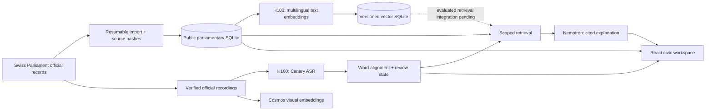
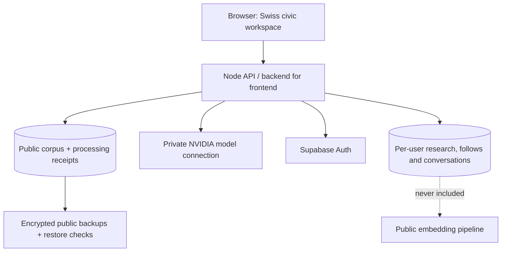

<div align="center">

# midnight.vote · Switzerland

### A clearer view. Your own decision.

A civic research workspace that connects questions about Swiss public life to **original parliamentary words, identifiable speakers and verifiable sources**.

[Explore the experience](#the-experience) · [Architecture](#how-it-works) · [Run locally](#run-locally) · [Delivery status](#built-today-and-product-vision) · [Documentation](#documentation)


**Independent Swiss pilot · Built during the HPE–NVIDIA Agentic AI Hackathon / Swiss {ai} Weeks**

</div>

## Why this exists

Public decisions deserve more than a headline. Parliamentary records are rich, multilingual and spread across long debates, proposals, individual votes and recordings. Finding the relevant statement—and checking what it actually meant—takes time.

Midnight Vote brings that evidence into one place. Start with a question, inspect an attributed passage, return to its surrounding debate, and watch the corresponding recording where timing has been established. **Cleisthenes**, the contextual civic companion, helps explain the material while keeping the sources close.

The aim is informed judgment: citizens forming their own views, with enough detail for journalists, students and researchers to inspect the evidence themselves.

## The experience

| Workspace | What you can do |
| --- | --- |
| **Home** | Browse dated proceedings, a calendar, explicit follows, recent research and public-source updates. |
| **Parliament** | Explore separately verified National Council and Council of States seat maps; inspect representatives, proposals, original passages and recorded votes. |
| **Topics & votes** | Search historical example dossiers, compare attributed arguments and open an Overview / Debate / Timeline / Sources workspace. |
| **Cleisthenes** | Ask source-scoped questions, inspect citations, translate passages and continue researching without losing context. |
| **Saved & settings** | Save research with an account; control reading preferences and optional personalisation. Anonymous conversations stay in the browser. |


### From a question to the original record

1. Search a topic or ask Cleisthenes within a proposal, person or passage.
2. Open the cited words, with speaker, date and official source.
3. Read the original language or a clearly labelled translation.
4. Play a bounded clip when alignment exists; otherwise open the full official intervention or transcript.
5. Save the source or use it in a cited brief.

The landing demonstrates a **real processed recording**: Thomas Rechsteiner discussing the electronic health record on 14 September 2026, at **3:47–4:13**. The quotation comes from the official Bulletin. NVIDIA Canary supplied machine timing; human timing review remains pending.



## Built today and product vision

Implementation is not the same as production acceptance. This table makes the distinction explicit.

| Capability | Current state | Next acceptance step |
| --- | --- | --- |
| Original parliamentary text and provenance | Imported, searchable and source-linked | Continue incremental updates and coverage audits |
| Chamber explorer | Dated 2D snapshots: **200 National Council + 46 Council of States seats**; party and group remain distinct | Revalidate every new seating snapshot before publication |
| Representative profiles | Official identity, canton, party/group, recorded terms, declared background and imported votes | Broaden biography and historical vote coverage |
| Contextual AI answers | Implemented with original citations and scoped retrieval | Independent multilingual and semantic evaluation |
| Translation | Original text retained; provider-dependent machine output labelled | Language review and production service acceptance |
| Video | Real recordings, selected timed passages, full-intervention fallback | Full-session ASR and human timing review |
| Text embeddings | **16,471 passages / 16,488 chunks** persisted and validated on H100 | Wire the new text index into evaluated semantic retrieval; it does not yet replace lexical retrieval |
| Accounts | Separate email/OAuth flows, persistent encrypted sessions, per-user storage | Real email and Google provider acceptance in production |
| Backups | Encrypted public-corpus backup and isolated restore tested | Off-device storage, independent key custody and daily scheduling |
| Feedback | UI and spam-protected email adapter implemented | Connect and verify the production sender |
| Private eligibility and community votes | Clearly labelled interactive concepts | Future protocol integration and independent security review |

**No official vote is cast by this pilot.** Passport signatures, biometric confirmation, private eligibility proofs and community voting are not operational features. Missing records are not abstentions; visual similarity is not evidence of what someone said.

## Data and compute snapshot

Snapshot: **18 September 2026**. These counts describe the imported collection, not the entire history of Swiss Parliament.

| Imported text scope | Passages | Text embedding chunks |
| --- | ---: | ---: |
| Session 5213 | 2,469 | 2,471 |
| Session 5214 | 10,180 | 10,190 |
| Session 5215, published material as imported | 3,575 | 3,580 |
| Additional imported records | 247 | 247 |
| **Total** | **16,471** | **16,488** |

The full text embedding run completed on an **NVIDIA H100 NVL** in 214 seconds after model loading. It uses `intfloat/multilingual-e5-large`, pinned by the recorded model revision, with 1,024-dimensional normalized vectors. Long passages use overlapping token windows. Validation checks source hashes, finite vectors, normalization, text boundaries and complete imported-passage coverage. This is a batch measurement, not a latency guarantee.

A resumable **3,346-recording queue** covers the three imported sessions, prioritising the current session. It verifies official recording URLs, preserves media hashes, transcribes bounded audio windows with NVIDIA Canary and records success/failure in SQLite. Queued does not mean completed; media, ASR, text embeddings, visual embeddings and alignment are tracked separately.

The previously processed Cosmos visual embeddings remain distinct from the new multilingual text embeddings. Private conversations, account data and feedback are excluded from the public processing corpus.

## How it works





**Frontend:** React 19, Vite, TypeScript/JavaScript, custom SVG chambers and the Greek–Swiss visual system.  
**Backend:** Node.js 24, built-in SQLite, explicit HTTP API and server-managed sessions.  
**AI:** Nemotron for explanations; Canary/Parakeet for recorded ASR work; Cosmos for experimental visual retrieval; multilingual E5 for the new text index.  
**Accounts:** Supabase Auth and per-user access controls.  
**Operations:** isolated deployment, source checksums, resumable processing and encrypted public-data restoration.

## Evidence and privacy principles

- **Original wording stays visible.** Official text, ASR output, translation and generated explanation are separate records.
- **Attribution is explicit.** A speaker's current party does not rewrite historical membership or turn a reported position into their own.
- **Timing is earned.** A video URL alone does not establish an exact quotation timestamp.
- **Coverage is disclosed.** Partial imports, unavailable recordings and stale sources remain visible.
- **Personalisation is chosen.** Follows and optional canton preferences never imply political affiliation.
- **Public and private data stay separate.** Public evidence can be processed and indexed; personal chats and account records are not a training or RAG shortcut.
- **Failures stay honest.** Unavailable providers and unverified claims are not silently replaced with fabricated answers.

## Run locally

Requirements: **Node.js 24** and npm. A GPU is optional for browsing; model-backed features require configured services. Public datasets and credentials are intentionally not committed to Git.

```bash
npm ci --prefix frontend
npm run build --prefix frontend
npm start
```

Open **http://127.0.0.1:4318/**. The historical example dossiers are seeded locally. To populate the parliamentary corpus, use the documented import scripts; a fresh clone does not include the operator's imported database or media.

Optional: copy `.env.example` to `.env` and configure server-side providers. Never put private keys or server credentials in `VITE_*` variables. For frontend development, run `npm run dev --prefix frontend` alongside the API.

```bash
# Import one complete published text snapshot; processing is a separate stage.
node scripts/ingest-session.mjs --session=5215

# Prepare public-only input for the H100 batch.
node scripts/export-public-embedding-input.mjs

# On the GPU host with its ML environment:
CUDA_VISIBLE_DEVICES=1 python scripts/embed-public-corpus.py data/public-embedding-input.jsonl data/public-embeddings.sqlite

# Validate copied vectors against the local official corpus.
node scripts/validate-public-embeddings.mjs
```

GPU dependencies live in the processing environment, not the frontend install. See the pipeline documentation before running ASR or VSS services.

## Validate a change

```bash
npm test
npm run test:api --prefix frontend
npm run test:sites --prefix frontend
npm run build --prefix frontend
```

Tests cover source attribution, ownership, session handling, citation boundaries, chamber validation, timezones, search, media paths, feedback failures and backup restoration. Mocked provider tests do not prove real email delivery or live account configuration.

## Documentation

| Guide | Purpose |
| --- | --- |
| [Documentation index](docs/README.md) | Product and engineering reference map |
| [Civic workspace delivery](docs/CIVIC-WORKSPACE-DELIVERY.md) | Accepted scope, completed work and remaining gates |
| [Media pipeline](docs/SESSION-PIPELINE.md) | Recording verification, ASR, alignment and visual processing |
| [Deployment and integration](docs/GREEK-SWISS-INTEGRATION.md) | Swiss mount, hosting isolation and release boundaries |
| [Landing, routing and feedback](docs/LANDING-ROUTING-FEEDBACK.md) | Real example, feedback setup and public-data backups |
| [Speaker context](docs/SPEAKER-CONTEXT-UPDATE.md) | Biographies, citation inspectors and recording fallback |
| [Operational runbook](docs/PILOT-RUNBOOK.md) | Historical implementation log; later delivery notes supersede older limitations |
| [Environment template](.env.example) | Server-side configuration names, without secrets |

## Repository map

```text
frontend/src/pilot/       Citizen-facing workspace and landing
frontend/src/services/    API client boundary
server/                  HTTP API, retrieval, accounts and public catalog
server/chamber-snapshots/ Verified, versioned seating layouts
server/tests/            Backend and data-integrity checks
scripts/                 Import, H100 processing, validation and backup tools
deploy/switzerland/      Isolated Swiss deployment and routing files
docs/                    Product, architecture, operations and screenshots
data/                    Ignored local databases, media and credentials
```

## Contributing and release discipline

This fork develops the Swiss pilot on **`feat/swiss-citizen-pilot`**. Submit focused changes against the fork's pilot branch; do not push directly to the upstream project's main branch. Keep source provenance, accessibility and honest coverage labels intact. Include relevant tests and disclose provider-dependent acceptance that has not been exercised.

Report problems through the in-app feedback entry or **contact@midnight.vote**. Never include passwords, identity documents or private conversations in a public issue.

## Sources and acknowledgements

Built on the original **Swiss Parliament Intelligence** hackathon project, with public records and imagery from Swiss Parliamentary Services. Parliamentary media remains subject to its [source usage conditions](https://www.parlament.ch/de/services/Seiten/Nutzungsbedingungen.aspx); credit **© ParlCH** and any named photographer. This non-commercial civic pilot has no government affiliation.

Model weights, fonts and third-party assets retain their own licences. The repository does not assign a new blanket licence to those materials. The screenshots above show the implemented interface, not a design mockup.
