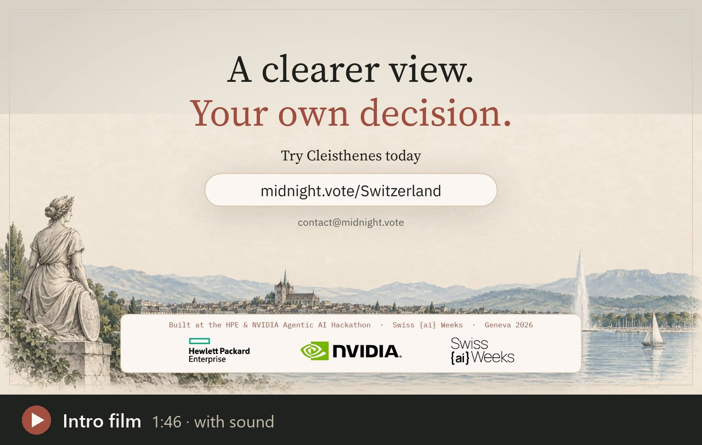
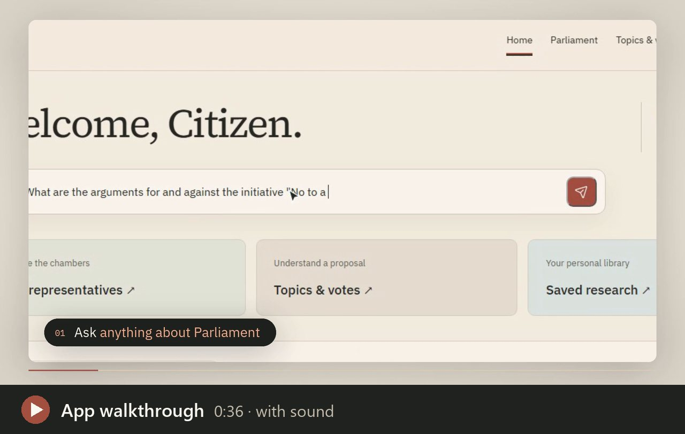
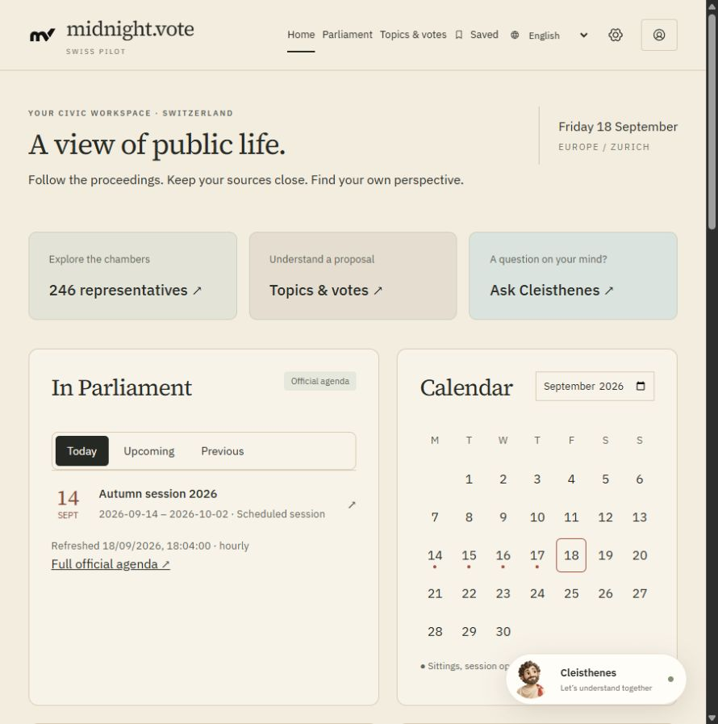

<div align="center">

# Cleisthenes

### A clearer view. Your own decision.

Your evidence-backed AI civic companion for understanding Swiss public decisions: ask in your language, get an answer built from the official parliamentary record, with the original words, the speaker and the exact video moment.

[Open the Swiss pilot](https://midnight.vote/Switzerland/) · [How it works](docs/HOW-CLEISTHENES-WORKS.md) · [How AI is used](docs/AI-IN-CLEISTHENES.md) · [Architecture](docs/ARCHITECTURE.md) · [Current status](docs/STATUS.md) · [Run locally](#run-locally)

[](https://github.com/tomasgarro/swiss-parliament-intelligence/releases/download/hackathon-2026-09-24/cleisthenes-intro.mp4)

**▶ [Watch the intro film](https://github.com/tomasgarro/swiss-parliament-intelligence/releases/download/hackathon-2026-09-24/cleisthenes-intro.mp4)** (1:46, with sound) · [App walkthrough](#see-it-in-action) (0:36)

**Independent Swiss pilot · Built during the HPE–NVIDIA Agentic AI Hackathon / Swiss {ai} Weeks**

</div>

## See it in action

[](https://github.com/tomasgarro/swiss-parliament-intelligence/releases/download/hackathon-2026-09-24/cleisthenes-app-walkthrough.mp4)

**App walkthrough** · 0:36 · with sound. The product flow: ask a question, get an answer with both sides and a citation on every claim, open the source with its translation, see who is speaking and how they voted, explore the chamber, and see what Cleisthenes will not do.

Both videos are 1080p MP4 files attached to the [hackathon release](https://github.com/tomasgarro/swiss-parliament-intelligence/releases/tag/hackathon-2026-09-24). For how the whole system fits together on one page (diagrams, the two H100s, embeddings, status), read **[How Cleisthenes works](docs/HOW-CLEISTHENES-WORKS.md)**.

## The problem

Switzerland's Parliament publishes everything: every speech in the Official Bulletin, every individual vote, every proposal and hours of video, in French, German and Italian. It is authoritative, and in practice almost unreadable. A citizen who wants to know *what was actually argued* about an initiative has to search three languages, open dozens of transcripts and scrub through video.

## Meet Cleisthenes

Cleisthenes is **your evidence-backed AI civic companion for understanding Swiss public decisions.** You ask a question in your language; Cleisthenes searches the official record, reads the relevant speeches, checks every statement against its source and answers with numbered citations, the original words and, where available, the exact moment in the parliamentary video.

- **A guide, not an authority.** It explains what was said and by whom. It never tells you how to vote and never predicts results; those questions are refused with a neutral alternative ("see the arguments on each side").
- **The public record is the evidence.** Official Bulletin text is what gets quoted. Machine transcripts and video timings are aids, always labelled as such.
- **Honest about gaps.** When the record does not answer a question, Cleisthenes says so, or searches the web and shows those findings separately, labelled *Beyond the parliamentary record*.
- **Playful, not trivial.** Friendly guide, warm Greek–Swiss design and small prompts that reward exploring sources. Playfulness never means gamifying political choices.

## One question in 60 seconds

*"What are the arguments for and against the initiative 'No to a Switzerland of 10 million'?"*

1. Cleisthenes shows its research live, one step at a time: understanding, searching 134 sessions in FR/DE/IT, reading, checking statements, writing.
2. The answer arrives in about 20 seconds on the live pilot: a direct summary, sections for each side, and small numbered citations on every sentence.
3. The evidence card plays **Lorenzo Quadri (for)** and **Céline Weber (against)** from the official video at the exact moment, with the original words and a labelled English translation.
4. A citation opens the source drawer: speaker, role, party, the full passage in context and a link to the Official Bulletin.
5. Follow-ups remember the conversation: *"What did he vote on it?"* is understood as *"What did Lorenzo Quadri vote on…"*.



## What you can do

| Area | What it offers |
| --- | --- |
| **Ask Cleisthenes** | Cited answers in EN/FR/DE/IT, evidence moments with video, translations, research summary, follow-ups that remember the thread, labelled web research for news and upcoming sessions. |
| **Home** | One Parliament agenda: sessions and sittings by day, colour-coded by chamber; one click asks what happened or what is planned. |
| **Parliament** | Verified seating of both chambers, 254 current members with full official profiles, complete individual vote histories with what *yes* and *no* meant. |
| **Topics & votes** | Search across ~54,000 proposals in the archive, curated popular-vote dossiers, featured debates. |
| **My chats** | Every conversation in one place; on this device, or synced when signed in. |

## How AI is used

AI finds, reads, translates and explains; deterministic code decides what counts as evidence. The full technology → feature → outcome table is in [How AI is used in Cleisthenes](docs/AI-IN-CLEISTHENES.md).

| Technology | What it does | Outcome for the reader |
| --- | --- | --- |
| **NVIDIA Nemotron Nano 9B v2** (H100, NIM) | Understands questions, translates search terms, extracts and reviews claims, writes the answer, resolves follow-ups | Clear answers in your language, built only from checked sources |
| **NVIDIA Canary 1B v2** (H100) | Transcribes parliamentary video with word timings | 14,556 passages linked to the exact video moment |
| **multilingual-e5-large** (H100 batch, CPU queries) | Semantic index of 1,140,943 passages | Questions find the right speeches across languages |
| **NVIDIA Riva Translate** | Translates originals on demand | Original words plus a labelled translation |
| **TypeSafe Jev** (shadow) | Independent claim-versus-source check with calibrated confidence | A second safety net against mistranslated claims |
| **Web search** (gpt-6-luna) | Only for news and upcoming sessions | Separate, labelled web findings with links |
| **Deterministic code** | Quotes, dates, roles, vote counts, citations, refusals | Every number and quotation is exact and traceable |

## Built on NVIDIA

- **Live inference:** Nemotron Nano 9B v2 as an NVIDIA NIM on H100 GPUs (NVIDIA LaunchPad); automatic fallback to NVIDIA's hosted API catalog (Nemotron 3 Super 120B) when the GPU allocation ends, verified end to end on the demo questions; the catalog key is configured on the live server.
- **Batch processing on H100:** Canary speech recognition (11,092 recordings so far, still running) and the E5 semantic index (1,140,943 passages in under 10 minutes, ~1,900 passages per second).
- **After the hackathon:** semantic search runs on an ordinary CPU (int8 index, ~1 s per search over the full archive); answers stay on NVIDIA models through the API catalog.

## Coverage and limits (23 September 2026)

- 185 official sessions declared (1990–2026); official text is searchable for **134 sessions (1999–2026, 1,140,943 passages)**. Older sessions have no digital transcript in the official service.
- 221,752 recording jobs; **11,092 transcribed** so far, **14,556 passages** with machine-aligned video moments, none yet human-reviewed.
- **254 of 254 current members** have complete official profiles and vote histories (790 people in total).
- A speech is one person's intervention, not a decision of Parliament. Missing vote records are not abstentions.

## Privacy layer (future)

Midnight is the privacy layer, not the headline: selective disclosure could later prove eligibility (for example Swiss citizen, 18+, canton) for non-binding participation without revealing identity. Reading and asking never require it; participation features remain clearly labelled concepts.

## Where the work happens

| Question | Entry point |
| --- | --- |
| Which API endpoint answers a question? | [`server/index.mjs`](server/index.mjs) (`POST /api/parliament/ask`, `/ask/stream`) |
| Where are retrieval, scope and follow-ups decided? | [`server/parliament-ai.mjs`](server/parliament-ai.mjs), [`server/conversation.mjs`](server/conversation.mjs) |
| Where is the answer synthesised and language-checked? | [`server/answer-synthesis.mjs`](server/answer-synthesis.mjs) |
| Semantic search and query embeddings | [`server/semantic-search.mjs`](server/semantic-search.mjs), [`server/query-embedding.mjs`](server/query-embedding.mjs) |
| Web research and the model fallback | [`server/web-research.mjs`](server/web-research.mjs), [`server/model-endpoint.mjs`](server/model-endpoint.mjs) |
| Bulk speech recognition and embeddings on the GPU | [`scripts/process-public-sessions.py`](scripts/process-public-sessions.py), [`scripts/embed-public-corpus-batched.py`](scripts/embed-public-corpus-batched.py) |
| Pulling GPU results back safely | [`scripts/pull-gpu-checkpoint.sh`](scripts/pull-gpu-checkpoint.sh) |

For the full request path and trust boundaries, read [Architecture and data provenance](docs/ARCHITECTURE.md); for the per-session matrix, [Current status](docs/STATUS.md).


## Run locally

Requirements: Node.js 22.13 or newer and npm. A GPU is optional for browsing and deterministic source access; live model-backed features require configured private services. Public databases, media and credentials are intentionally not committed.

```bash
npm ci --prefix frontend
npm run build --prefix frontend
npm start
```

Open `http://127.0.0.1:4318/`. The repository includes seeded example dossiers, while the operator's imported corpus remains under ignored `data/` artifacts.

Optional server-side configuration is documented in [`.env.example`](.env.example). Never put private provider keys in `VITE_*` variables.

To declare the archive, process its resumable text queue and reconcile profile gaps:

```bash
npm run archive:discover -- --from-year=1990 --to-year=2026
npm run archive:import:text -- --limit=5
npm run profiles:backlog
npm run profiles:enrich -- --limit=5
```

Read [the session pipeline](docs/SESSION-PIPELINE.md) before running media, ASR, alignment, VSS or embedding stages.

## Validate a change

```bash
npm run docs:check
npm test
npm run test:api --prefix frontend
npm run test:sites --prefix frontend
npm run build --prefix frontend
```

Operators with the ignored processing artifacts can reproduce the coverage table with:

```bash
npm run docs:status
```

## Documentation

- [How Cleisthenes works](docs/HOW-CLEISTHENES-WORKS.md): the one-page walkthrough with diagrams
- [Developer documentation index](docs/README.md)
- [Product specification](docs/PRODUCT-SPEC.md)
- [Architecture and data provenance](docs/ARCHITECTURE.md)
- [Current implementation and corpus status](docs/STATUS.md)
- [Session, recording and GPU pipeline](docs/SESSION-PIPELINE.md)
- [Operations and deployment](docs/OPERATIONS.md)
- [Contribution and branch policy](CONTRIBUTING.md)
- [Historical implementation record](docs/archive/2026-09/README.md)

## Evidence and privacy rules

- Official text, ASR output, translation and generated explanation remain separate records.
- A current party membership never rewrites historical membership or turns a reported position into a personal position.
- Missing votes are not abstentions, and a recording URL is not an exact quotation timestamp.
- Queued, downloaded, transcribed, aligned, visually embedded and human-reviewed are separate states.
- Public evidence may be processed and indexed; private chats, accounts and feedback are not included.
- Provider failures and unsupported questions remain visible rather than being replaced with fabricated answers.

## Repository and release discipline

Work happens on short-lived branches in Tomas Garro's fork and reaches `main` through reviewed pull requests. The organization repository is never updated without explicit approval. See [CONTRIBUTING.md](CONTRIBUTING.md).

This non-commercial civic pilot is independent and has no government affiliation. Parliamentary material comes from Swiss Parliamentary Services and remains subject to its [source usage conditions](https://www.parlament.ch/de/services/Seiten/Nutzungsbedingungen.aspx); credit **© ParlCH** and any named photographer. Model weights, fonts and third-party assets retain their own licences.
