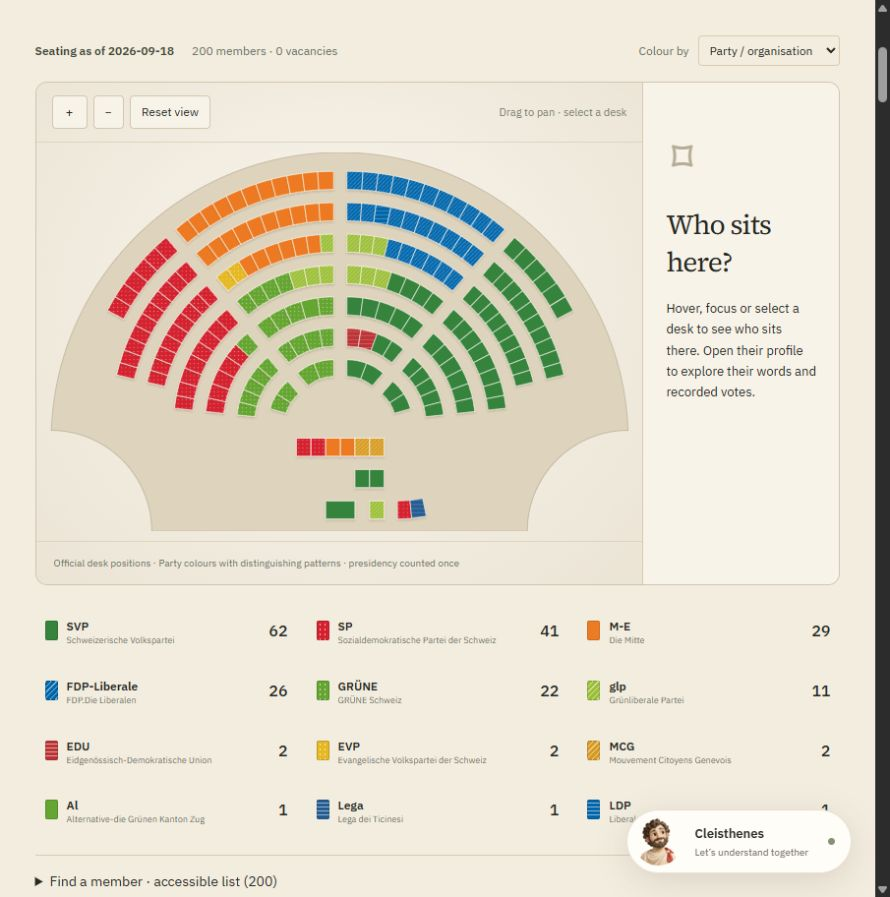
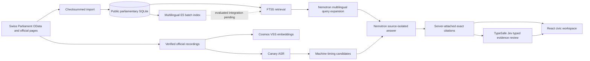

<div align="center">

# Cleisthenes

### A clearer view. Your own decision.

An evidence-backed AI civic companion for understanding Swiss public decisions through original parliamentary words, identifiable speakers, recorded proceedings and verifiable sources. Privacy and future selective disclosure are powered by the separate Midnight layer.

[Open the Swiss pilot](https://midnight.vote/Switzerland/) · [Technical architecture](docs/ARCHITECTURE.md) · [Data pipeline](docs/SESSION-PIPELINE.md) · [Current status](docs/STATUS.md) · [Run locally](#run-locally)


**Independent Swiss pilot · Built during the HPE–NVIDIA Agentic AI Hackathon / Swiss {ai} Weeks**

</div>

## What the product does

Swiss parliamentary records are authoritative but fragmented across debates, proposals, votes, profiles and long recordings. Cleisthenes brings those records into one research flow:

1. Ask a question or open a proposal, person or passage.
2. Retrieve relevant material from the imported official corpus.
3. Read a short, source-scoped explanation from **Cleisthenes**.
4. Inspect the original wording, speaker, date and official link.
5. Play a bounded recording only where machine timing has been established; otherwise open the full official intervention.

Citizens are the primary audience. Journalists, students and researchers can use the same source inspectors, filters and dated coverage notes for deeper verification. The pilot does not cast official votes and does not infer a user's political affiliation.


## What is available

| Workspace | Current capability |
| --- | --- |
| **Home** | Dated proceedings, official session calendar, explicit follows, recent research and source updates. |
| **Parliament** | Verified 2D National Council and Council of States seating snapshots, representative profiles, proposals, speeches and imported roll calls. |
| **Topics & votes** | Searchable example dossiers with Overview / Debate / Timeline / Sources views. |
| **Cleisthenes** | Contextual questions, multilingual retrieval, cited explanations, passage translation and source inspection. |
| **Accounts** | Passwordless/password entry, persistent server sessions, per-user saved material and optional MFA. Anonymous research stays in the browser. |



Implementation is not the same as acceptance. See [the current status](docs/STATUS.md) for exact imported coverage, processing counts and remaining review gates.

## How it actually works



The application does not send a video directly to the language model. Text, video and generation are separate paths:

- **Official text** is imported from Swiss Parliament OData into SQLite with source URLs, timestamps, hashes and retained revisions.
- **Retrieval** currently uses SQLite FTS5. Nemotron generates French, German and Italian search terms, but the ranking remains lexical. The E5 vector database has been persisted and validated; it is not yet the production retriever.
- **Generation** receives at most a few selected source records. Each model call handles one source at a time, and the server attaches the exact quotation afterward. A second model check can withhold unsupported claims.
- **Typed evidence review** can send only the generated claim and its associated public source to TypeSafe Jev. Code first verifies the quote locally; Jev classifies the relationship as supporting, contradicting or silent. Shadow mode measures decisions without changing answers.
- **Video** is discovered from an official Parliament page, downloaded only from the Parliament-linked Simplex host, hashed, transcribed separately and aligned back to official Bulletin text.
- **Visual search** uses Cosmos embeddings through VSS. It is experimental image similarity and never evidence of what a speaker said.
- **Private account data** is stored separately and is excluded from the public processing and embedding corpus.

For the complete request path, trust boundaries and data-source catalog, read [Architecture and data provenance](docs/ARCHITECTURE.md).

## AI and processing technologies

| Technology | Used for | Not used for |
| --- | --- | --- |
| **NVIDIA Nemotron Nano 9B v2** | Multilingual query expansion, cited explanations, claim review, guarded comparison and editable correspondence drafts. | Ingesting video, choosing official truth or replacing citations. |
| **NVIDIA Canary 1B v2** | Current bulk parliamentary-recording ASR and word-timed machine alignment candidates. | Authoritative transcript text or human timing approval. |
| **NVIDIA Parakeet** | Earlier bounded ASR experiments retained for provenance. | The current full-session worker. |
| **Riva Translate 4B Instruct v2** | Server-side passage translation with number/language checks. | Main ASR or generative answers. |
| **Cosmos Embed1-448p / VSS** | Experimental video-chunk and text-query embeddings for visual similarity. | Verification of spoken content or political interpretation. |
| **multilingual-e5-large** | 1,024-dimensional normalized text embeddings in a validated batch SQLite index. | Current production retrieval; integration remains pending evaluation. |
| **TypeSafe Jev** | Optional typed claim/source relationship review after deterministic quote matching; shadow mode first. | Writing answers, setting policy, processing private profiles/chats or replacing human review. |
| **SQLite FTS5** | Current deterministic candidate retrieval before generation. | Semantic vector ranking. |

The production deployment reaches the GPU services through a private SSH tunnel. Browser clients never receive model credentials.

## Where the work happens

| Question | Entry point |
| --- | --- |
| Where is a complete session imported? | [`scripts/ingest-session.mjs`](scripts/ingest-session.mjs) |
| How is an official video found and downloaded? | [`scripts/prepare-session-media.mjs`](scripts/prepare-session-media.mjs) |
| What performs the resumable bulk ASR work? | [`scripts/process-public-sessions.py`](scripts/process-public-sessions.py) |
| Which API endpoint accepts an AI question? | [`server/index.mjs`](server/index.mjs) (`POST /api/parliament/ask`) |
| Where are retrieval and evidence scope chosen? | [`server/parliament-ai.mjs`](server/parliament-ai.mjs) |
| Which file sends `/chat/completions` to Nemotron? | [`server/research.mjs`](server/research.mjs) |
| Where is TypeSafe Jev integrated? | [`server/typesafe-review.mjs`](server/typesafe-review.mjs) |
| Where is experimental VSS search implemented? | [`server/video-search.mjs`](server/video-search.mjs) |
| How are production model services connected? | [`deploy/switzerland/compose.hostinger.yaml`](deploy/switzerland/compose.hostinger.yaml) |

## Data snapshot

The declared archive covers 185 official sessions from 1990 through 2026. One hundred and twenty-one sessions are currently text-complete, yielding 1,041,964 public passages and 205,797 recording jobs. The reconciled local ledger knows 5,618 ASR jobs as complete and reports 200,179 pending.

The immutable H100 handoff now running contains the first 14 imported sessions: 109,980 E5 inputs and 20,307 initial Canary jobs. E5 completed with 110,063 chunks. The one hundred and seven sessions imported after that handoff add 931,984 passages and 185,490 recording jobs to the next local delta. The latest checksummed active-worker checkpoint contained 2,280 provenance-valid transcripts; six empty or no-speech receipts were rejected rather than promoted.

The previously validated three-session checkpoint remains the publication baseline: 16,224 official-text passages, 16,241 persisted E5 chunks and 3,327 source-validated Canary receipts. After the latest active-worker checkpoint, alignment staging over all 5,607 validated receipts produced 7,988 machine timing candidates across 2,919 recordings. Seven official media URLs returned 404, eleven older receipts lacked current provenance metadata and six current receipts contained no usable speech. Archive-wide worker outputs do not enter the validated baseline until they return through the local provenance checks; none of these counts imply human review.

The profile ledger contains 780 people discovered in the imported record, including 254 active officials. Seventy-six profiles currently have a complete official-detail and bounded full-vote-service query, 270 have identity-verified official portraits and 704 remain in the enrichment queue. Active officials are prioritized ahead of historical profiles.

See [Current implementation and corpus status](docs/STATUS.md) for the per-session matrix and the distinction between pilot manifests, consolidated receipts, VSS coverage and reviewed publication state.

## Run locally

Requirements: Node.js 22.13 or newer and npm. A GPU is optional for browsing and deterministic source access; live model-backed features require configured private services. Public databases, media and credentials are intentionally not committed.

```bash
npm ci --prefix frontend
npm run build --prefix frontend
npm start
```

Open `http://127.0.0.1:4318/`. The repository includes seeded example dossiers, while the operator's imported corpus remains under ignored `data/` artifacts.

Optional server-side configuration is documented in [`.env.example`](.env.example). Never put private provider keys in `VITE_*` variables.

To declare the archive, process its resumable text queue and reconcile profile gaps:

```bash
npm run archive:discover -- --from-year=1990 --to-year=2026
npm run archive:import:text -- --limit=5
npm run profiles:backlog
npm run profiles:enrich -- --limit=5
```

Read [the session pipeline](docs/SESSION-PIPELINE.md) before running media, ASR, alignment, VSS or embedding stages.

## Validate a change

```bash
npm run docs:check
npm test
npm run test:api --prefix frontend
npm run test:sites --prefix frontend
npm run build --prefix frontend
```

Operators with the ignored processing artifacts can reproduce the coverage table with:

```bash
npm run docs:status
```

## Documentation

- [Developer documentation index](docs/README.md)
- [Product specification](docs/PRODUCT-SPEC.md)
- [Architecture and data provenance](docs/ARCHITECTURE.md)
- [Current implementation and corpus status](docs/STATUS.md)
- [Session, recording and GPU pipeline](docs/SESSION-PIPELINE.md)
- [Operations and deployment](docs/OPERATIONS.md)
- [Contribution and branch policy](CONTRIBUTING.md)
- [Historical implementation record](docs/archive/2026-09/README.md)

## Evidence and privacy rules

- Official text, ASR output, translation and generated explanation remain separate records.
- A current party membership never rewrites historical membership or turns a reported position into a personal position.
- Missing votes are not abstentions, and a recording URL is not an exact quotation timestamp.
- Queued, downloaded, transcribed, aligned, visually embedded and human-reviewed are separate states.
- Public evidence may be processed and indexed; private chats, accounts and feedback are not included.
- Provider failures and unsupported questions remain visible rather than being replaced with fabricated answers.

## Repository and release discipline

The active development branch is `feat/swiss-citizen-pilot` in Tomas Garro's fork. Until final submission, changes go there only; neither `fork/main` nor the organization repository is updated without explicit approval. See [CONTRIBUTING.md](CONTRIBUTING.md).

This non-commercial civic pilot is independent and has no government affiliation. Parliamentary material comes from Swiss Parliamentary Services and remains subject to its [source usage conditions](https://www.parlament.ch/de/services/Seiten/Nutzungsbedingungen.aspx); credit **© ParlCH** and any named photographer. Model weights, fonts and third-party assets retain their own licences.
