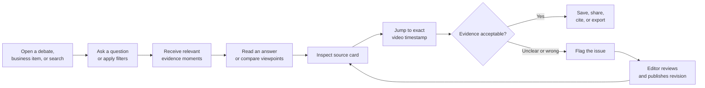

# Swiss Parliament Intelligence

Turn hours of multilingual parliamentary video into evidence people can **find, understand, compare, and verify at the exact timestamp**.

This project is being developed for the HPE–NVIDIA Agentic AI Hackathon during Swiss {ai} Weeks.

## Frontend prototype

The interactive desktop-first prototype lives in [`frontend/`](frontend/). It demonstrates the citizen-friendly Ask experience, source-linked citations, video controls, language and mode states, and the speaker list attached to each debate source.

```bash
cd frontend
npm install
npm run dev
```

## Product promise

Swiss Parliament already publishes recordings. The remaining problem is finding the relevant moment and understanding it without losing the original context.

Our product principle is:

> No important answer without a direct path back to the source video.

This is not just a transcript and not just a chatbot. It is an evidence workspace built around video moments.

## Who we are building for

### 1. Journalists, policy analysts, and researchers — beachhead user

**Their job:** find and compare defensible evidence across speakers, topics, business items, and sessions.

They need to answer questions such as:

- Who made this argument, and how did others respond?
- Where was a law, organization, number, or policy discussed?
- Did a speaker's position change over time?
- Can I cite and reproduce the evidence behind my conclusion?

**Current pain**

- Scrubbing through hours of video is slow.
- Exact-word search misses discussions phrased differently.
- Names, numbers, dialects, and legal terminology are frequent transcription failure points.
- Translations may hide ambiguity in the original wording.
- Summaries can omit minority views or counterarguments.
- Video, debate metadata, votes, and notes live in different places.
- A prose answer without stable citations is difficult to publish or defend.

**Desired outcome:** move from a research question to a reproducible collection of video evidence in minutes rather than hours.

### 2. Parliamentarians and parliamentary staff — second workflow

**Their job:** prepare for a business item, monitor debate, and produce a reliable briefing.

They need to answer:

- Which positions and objections were expressed?
- What did the minister, committee, or another group commit to?
- Which issues remain unresolved before the next sitting?
- Was a speech or statement attributed correctly?

**Current pain**

- Staff work against deadlines and cannot watch every sitting.
- Relevant remarks are fragmented across sessions and speakers.
- Incorrect names, numbers, or attribution create reputational risk.
- Summaries without exact evidence cannot safely enter a briefing.
- Political positions are nuanced and should not be reduced to model-generated labels.

**Desired outcome:** open a business item, inspect the relevant interventions, and produce a source-linked briefing that another person can verify.

### 3. Citizens and general readers — accessible public experience

**Their job:** understand a public issue well enough to form an informed view.

They ask:

- What happened?
- What were the main arguments and disagreements?
- What did my representative say?
- Where in the debate was this claim made?
- What does this technical term mean?

**Current pain**

- Sessions are long and use specialist vocabulary.
- Debate can switch between German, French, and Italian.
- Generic summaries flatten disagreement and remove context.
- It is hard to judge whether an AI answer is supported by the recording.

**Desired outcome:** ask a normal question, understand the different viewpoints, and verify each important point with one click.

### 4. Editors and data operators — enabling user

**Their job:** review uncertainty, correct transcript or speaker errors, and maintain a trustworthy searchable record.

This is a necessary operational role, but not the headline audience. Operators need a review queue, confidence signals, side-by-side audio/video context, and revision history that does not break existing citations.

## One product, different working modes

We should not build separate applications for every audience. Everyone uses the same source video, transcript, speakers, timestamps, and evidence identifiers. The interface changes its defaults and level of detail.

| Shared foundation | Citizen mode | Research mode | Parliamentary mode |
| --- | --- | --- | --- |
| Video player with timestamp seek | Plain-language question | Advanced search and filters | Business-item starting point |
| Original transcript | Short issue overview | Results table and bulk selection | Chronological intervention map |
| Translation switch | Viewpoints and responses | Compare speakers or sessions | Objections and commitments |
| Speaker and debate metadata | Explanations of jargon | Notes and evidence collections | Briefing collection |
| Evidence cards | Minimal controls | Provenance and revisions | Names and numbers review |
| Confidence and review state | Clear uncertainty message | Export citations and data | Attribution correction request |

The default experience should be simple. Research and Parliamentary modes reveal additional controls without changing the underlying facts.

## The evidence card

Every search result and every generated answer is built from the same inspectable object:

```text
video moment
+ exact start and end time
+ original-language transcript
+ identified speaker and language
+ session and business item
+ optional translation or interpretation
+ confidence and review status
+ stable evidence ID and revision
```

This evidence card is the bridge between all user journeys. A citizen opens it to verify a summary; a researcher cites it; parliamentary staff save it into a brief; an editor corrects it.

## Shared journey



## Journey 1: researcher or journalist

**Scenario:** “Find the discussion of implementation costs and compare the government and party responses.”

| Stage | User action | Product response | Main risk | Success signal |
| --- | --- | --- | --- | --- |
| Scope | Select dates, chamber, business, or language | Show exactly which recordings are searched | An unknown corpus makes work irreproducible | Corpus definition is visible and saved |
| Retrieve | Search using words or concepts | Return ranked, filterable video moments | Semantic search can overmatch | Relevant evidence appears in the first results |
| Inspect | Open transcript and surrounding video | Show the preceding and following statements | A quote can be removed from context | Context is always one click away |
| Compare | Group selected evidence by speaker or time | Summarize similarities and disagreements | The model may infer motive or position | Claims stay limited to explicit statements |
| Annotate | Add notes and exclude weak evidence | Save a private evidence collection | Notes may be confused with source facts | Notes are visually separate from evidence |
| Export | Download a cited evidence pack | Include source, timestamps, IDs, and versions | Prose-only output is unauditable | Another person can reproduce the result |

**Primary measures:** time to a reproducible evidence collection, relevant results in the top five, and citation correctness.

## Journey 2: parliamentary staff

**Scenario:** “Prepare for the next debate using unresolved objections and previous commitments.”

| Stage | User action | Product response | Main risk | Success signal |
| --- | --- | --- | --- | --- |
| Open business | Enter a business number or agenda item | Load its timeline, sessions, and speakers | Public information is fragmented | Correct business item opens immediately |
| Review | Filter by speaker, role, party, or committee | Show interventions chronologically | Labels can oversimplify nuance | Source passage appears before any label |
| Find obligations | Search for questions, objections, and commitments | Return the relevant exchange, not an isolated sentence | Important qualifiers may be missed | Evidence and counter-evidence appear together |
| Build brief | Save moments into briefing sections | Draft text around selected evidence | Generated prose may detach from its source | Every paragraph retains citations |
| Verify | Review names, numbers, speakers, and translations | Highlight uncertain fields | Errors create reputational risk | Nothing uncertain exports silently |
| Hand off | Share a read-only collection | Preserve corpus version and timestamps | Later corrections may change meaning | The link remains stable and shows revisions |

**Primary measures:** time to a cited briefing and number of consequential errors caught before export.

## Journey 3: citizen

**Scenario:** “Parliament debated electronic identity. What were the main disagreements?”

| Stage | User action | Product response | Main risk | Success signal |
| --- | --- | --- | --- | --- |
| Enter | Search a phrase or ask a question | Resolve the likely topic or business item | The user may not know official terminology | Correct debate appears without specialist wording |
| Orient | Read a short overview | Explain scope, date, and decision stage | A summary may sound biased or overly certain | Unresolved points and uncertainty are visible |
| Compare | Open viewpoints and responses | Present attributed arguments with evidence | Minority views may disappear | Relevant perspectives are represented |
| Verify | Click a citation | Open the original passage and seek the video | Speaker or translation may be wrong | Correct moment opens in one click |
| Continue | Explore a speaker or share a moment | Create a contextual source link | Shared clips can remove context | Link includes surrounding discussion |

**Primary measure:** median time from a normal-language question to a verified video moment.

## Core interface

The hackathon can demonstrate all three audiences using one screen and a mode switch:

```text
[Citizen] [Research] [Parliamentary]

Left:    video player and topic timeline
Center:  synchronized transcript and evidence passages
Right:   question, cited answer, compare/save actions
```

The most important interaction is not the answer itself. It is selecting a citation and immediately seeing the original passage in the transcript and video.

## Capabilities required for the first useful version

These describe user-visible needs, not a prescribed technical architecture.

| Priority | Capability | User value |
| --- | --- | --- |
| Must | Search a recording by words and concepts | Finds relevant discussion without knowing the exact phrase |
| Must | Timestamped transcript in its original language | Makes spoken evidence readable and navigable |
| Must | Speaker and session context | Establishes who said what and where |
| Must | Cited answers with evidence cards | Lets users verify generated text |
| Must | Click citation to seek video | Reduces verification to one action |
| Must | Original/translation toggle | Preserves meaning while improving accessibility |
| Must | Confidence and review labels | Makes uncertainty visible |
| Must | Correction and revision flow | Allows errors to be fixed without breaking citations |
| Should | Compare selected speakers or passages | Supports research and briefing work |
| Should | Save and export evidence collections | Makes findings reusable and reproducible |
| Could | Generate a cited business-item brief | Accelerates parliamentary preparation |
| Later | Compare topics across multiple sessions | Supports longitudinal research |

## How it works, in simple engineering terms

1. Register an official Parliament video and its public metadata.
2. Transcribe the speech with timestamps and language information.
3. Divide the recording into stable, searchable evidence moments.
4. Add speaker, session, business-item, and useful visual context.
5. Search those moments using keywords and meaning.
6. Generate answers only from the retrieved evidence.
7. Return timestamps and source cards with every material claim.

The implementation can use [NVIDIA Video Search and Summarization](https://docs.nvidia.com/vss/latest/) for video understanding, search, clips, and agent workflows, plus [NVIDIA Riva](https://docs.nvidia.com/deeplearning/riva/user-guide/docs/asr/asr-overview.html) for multilingual speech recognition. The technical team can choose the final deployment architecture.

## Trust and political-information rules

- Keep original transcript, translation, and AI interpretation visibly separate.
- Show the source passage before or beside an inferred position.
- Use labels such as “supported” or “opposed” only when the passage directly supports them.
- Allow `unclear`, `conflicting`, and `speaker unconfirmed`.
- Do not infer political ideology, emotion, intent, truthfulness, or sensitive traits.
- Show multiple relevant perspectives for broad comparison questions.
- Keep private notes separate from the public evidence record.
- Require human review before treating generated text as an official brief.

## What success looks like

For the hackathon, we should test a small set of real questions rather than claiming full archive coverage.

| Measure | What we check |
| --- | --- |
| Time to evidence | How quickly a user reaches a useful video moment |
| Search relevance | Whether the right passage appears in the first five results |
| Citation correctness | Whether the cited timestamp actually supports the claim |
| Speaker accuracy | Whether the statement is assigned to the right person |
| Language fidelity | Whether original wording is preserved and translations are labelled |
| User confidence | Whether users understand what is sourced, generated, or uncertain |
| Reproducibility | Whether another person can reopen the same evidence collection |

The single most important quality measure is **citation correctness**. A fluent answer pointing to the wrong parliamentary evidence is a product failure.

## Proposed demo journey

1. In Citizen mode, ask a plain-language question about a debate.
2. Show a short answer containing different viewpoints.
3. Open two citations and jump to the exact video moments.
4. Switch to Research mode and compare those passages in context.
5. Switch to Parliamentary mode and save them into a cited brief.
6. Flag one uncertain transcript or attribution and show its review state.

This demonstrates accessibility, analytical depth, and trust without pretending to build three separate products.

## Assumptions to validate with users

- Researchers begin with a topic or business item more often than a specific video.
- A timestamp and surrounding passage are sufficient for first-pass verification.
- Research exports must include stable evidence IDs, source URLs, timestamps, and versions.
- Parliamentary staff prefer business-item timelines over session-first navigation.
- Citizens benefit more from viewpoint comparison than from a single condensed summary.
- Users understand and value visible confidence and review labels.

## Validation questions

**For researchers and journalists**

- What must an evidence export contain before you can cite it?
- How much surrounding context is needed to avoid quote mining?
- Which transcription mistakes are most damaging to your work?

**For parliamentary staff**

- Do you normally begin with a business item, session, speaker, committee, or topic?
- What belongs in a briefing: arguments, objections, commitments, votes, or all four?
- Which generated labels would be too politically risky to use?

**For citizens**

- What would make you search a parliamentary recording?
- Which navigation is most useful: topic, speaker, party, or business item?
- Does one-click access to the original passage materially change your trust?

## Data sources

- [Swiss Parliament Media Library](https://www.parlament.ch/en/services/medialibrary)
- [Swiss Parliament YouTube streams](https://www.youtube.com/@ParlCH/streams)
- [Swiss Parliament Official Bulletin](https://www.parlament.ch/en/ratsbetrieb/official-bulletin)

## Immediate product decisions

- [ ] Select the first debate and three representative questions.
- [ ] Confirm the beachhead workflow with one journalist or policy researcher.
- [ ] Agree on the minimum contents of an evidence card.
- [ ] Sketch the shared screen and its three modes.
- [ ] Define the five-minute demo journey and fallback recording.
- [ ] Ask the technical team which required capabilities can be completed reliably.
