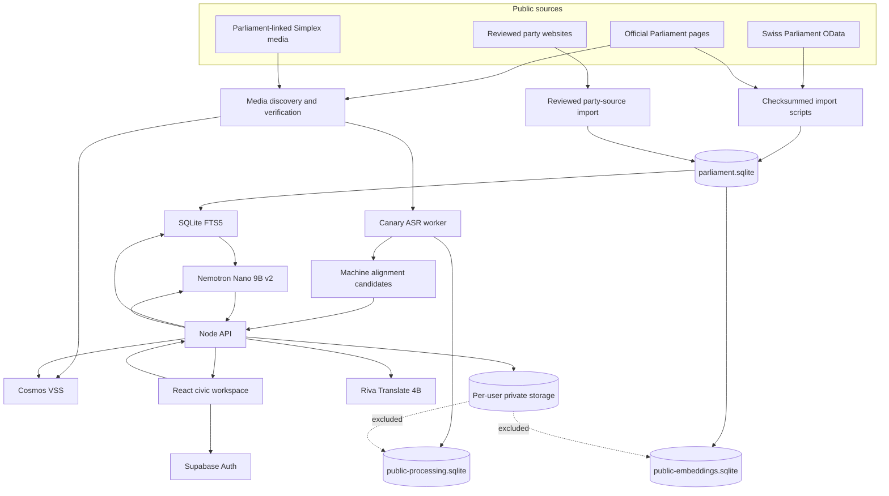

# Architecture and data provenance

## System purpose

Midnight Vote is an evidence-reading system with AI assistance, not a model trained to be an authority on Swiss politics. Official public records remain the evidence. Models help find, translate and explain a bounded selection of those records; the server keeps the original source alongside every supported claim.

## Component map

The public corpus, GPU processing receipts and private user data have different storage and access paths. None of the account, chat or feedback records are inputs to the public embedding pipeline.

## Data sources

| Source | Imported material | Provenance and limits |
| --- | --- | --- |
| Swiss Parliament OData | `Session`, `Meeting`, `Transcript`, `SubjectBusiness`, `Business`, `BusinessStatus`, `Vote`, `Voting`, `MemberCouncil`, `MemberCouncilHistory`, `SeatOrganisationNr` and `SeatOrganisationSr`. | Each normalized record retains an official URL, retrieval time and content hash. A cached session import is a frozen snapshot, not a live refresh. |
| Official Parliament web pages | Human-readable Bulletin links, recording templates, chamber plans and published portraits. | HTML is parsed only for bounded known fields. Downloaded JavaScript is treated as data; it is never evaluated by an importer. |
| Parliament-linked Simplex media | Official MP4 recordings resolved from the Parliament page. | The downloader accepts HTTPS media only from `par-pcache.simplex.tv`, applies size/time limits and stores a SHA-256 hash. A URL does not establish a quote timestamp. |
| Reviewed party websites | Dated summaries of a party's own published descriptions. | These are labelled party self-description. They are not Parliament records, independent analysis or an individual member's personal position. |
| Seeded example dossiers | Editorial examples that keep the product usable in a fresh clone. | They are not evidence that the complete live corpus is bundled in Git. Fictional or simulated UI states stay labelled. |
| Supabase | Authentication and per-user saved research, preferences and conversations. | Private application data is isolated from the public evidence, ASR, VSS and text-embedding datasets. |

## Parliamentary question request

The main question path is deliberately split across small boundaries:

1. `frontend/src/services/pilotApi.js` posts the question and selected scope to `POST /api/parliament/ask`.
2. `server/index.mjs` validates request length, language, origin and rate limits, then calls `answerParliament`.
3. `server/parliament-ai.mjs` selects the person/business/passage scope, queries SQLite FTS5 and may ask Nemotron for French, German and Italian search terms.
4. At most three relevant passages become evidence records. The retrieved original text is treated as untrusted data, not model instructions.
5. `server/research.mjs` sends the actual OpenAI-compatible `POST {INFERENCE_BASE_URL}/chat/completions` request. Each inference is isolated to one evidence record; two requests may overlap for latency.
6. The model returns claim text plus an allowed evidence ID. The server attaches the exact source quotation instead of asking the model to reproduce it.
7. `server/claim-review.mjs` can make a second constrained model call to reject claims that are unsupported, misattributed, overgeneralized or irrelevant.
8. The response returns passages, source metadata, retrieval method, review state, coverage disclosure and latency to the frontend.

When live inference is not configured, supported seeded dossiers can return labelled editorial extracts. Unknown or unsupported prompts return an explicit insufficient-evidence/provider state; they are not answered from model memory.

## Video path

Video does not go to Nemotron.

1. `scripts/ingest-session.mjs` creates a recording job for every displayed speech record while importing official text.
2. `scripts/prepare-session-media.mjs` verifies the official page, resolves its download template, downloads a bounded MP4 and records its hash.
3. `scripts/process-public-sessions.py` is the resumable full-queue worker. It downloads missing verified media, slices long audio into 300-second windows, runs Canary and shifts word timings back to the full-recording timeline.
4. `scripts/import-public-processing.mjs` validates session, source URL, language, model, duration and media hash before accepting a receipt into `public-processing.sqlite`.
5. `scripts/stage-public-alignments.mjs` compares Canary words with official Bulletin paragraphs and produces machine timing candidates for review.
6. Separately, `scripts/process-vss-video.py` and `scripts/preserve-vss-embeddings.py` create Cosmos video chunks. `server/video-search.mjs` embeds a text query and ranks those chunks by cosine similarity.

ASR text is not substituted for the Official Bulletin. A machine alignment candidate is not a human-reviewed timestamp. Cosmos similarity is not evidence that the query was spoken.

## Technology responsibilities

| Component | Deterministic or model-based | Responsibility |
| --- | --- | --- |
| OData import and SQLite normalization | Deterministic | Source retrieval, hashing, revisions, attribution and filtering of non-displayed procedural text. |
| SQLite FTS5 | Deterministic | Current production candidate retrieval. |
| Nemotron Nano 9B v2 | Model | Query translation, source-bounded explanation, claim review, comparison and correspondence drafting. |
| Canary 1B v2 | Model | Current bulk recording transcription and word timing. |
| Parakeet | Model | Earlier bounded ASR pilot retained for reproducibility. |
| Riva Translate 4B | Model | Passage translation with source preservation and validation gates. |
| Cosmos Embed1 / VSS | Model | Experimental visual embedding and similarity. |
| multilingual-e5-large | Model | Offline text-vector generation; production retrieval integration is pending evaluation. |
| Citation attachment and policy guards | Deterministic | Exact source quote attachment, allowed evidence IDs, attribution vetoes and coverage labels. |
| TypeSafe Jev | Model | Optional typed `supports` / `contradicts` / `says_nothing` review of a generated claim against its public source. Shadow mode records decisions without changing answers; enforcement is confidence-gated. |

Jev receives only the generated claim, its exact public quotation, the associated public source passage and public attribution metadata. Account data, saved research, conversation history and user profile data are excluded. Before calling Jev, code verifies that the quotation occurs in the source. The default `TYPESAFE_MODE=off`; `shadow` exposes evaluation metadata without filtering, while `enforce` retains only high-confidence supported claims and falls back to sources if the service is unavailable.

The integration follows the current TypeSafe HTTP quickstart: `POST https://api.typesafe.ai/v1/systemone`, bearer authentication, `jev-latest`, a structured public `state`, and one typed Choice question per claim. To activate it, create an API key in the TypeSafe console, place `TYPESAFE_API_KEY` only in the uncommitted local `.env`, set `TYPESAFE_MODE=shadow`, and run `npm run evaluate:typesafe`. A passing synthetic run proves the request contract and fixture behaviour, not production semantic quality; enforcement remains disabled until a corpus-specific adjudicated evaluation is accepted.

## Trust boundaries

- Model endpoints and API keys are server-side only.
- Production connects to GPU services through a restricted no-shell SSH account with an explicit port allowlist.
- Source content is untrusted input and cannot override system prompts or server validation.
- Public release packages exclude environment files, session stores, private account exports, keys and feedback.
- Text embeddings contain public parliamentary material only. Private conversations are not a retrieval shortcut or training corpus.
- A successful request proves service availability for that request, not continuing provider health or semantic acceptance.

## Storage and interfaces

| Artifact | Purpose | Committed? |
| --- | --- | --- |
| `data/parliament.sqlite` | Normalized official records, revisions and FTS5 index. | No |
| `data/public-processing.sqlite` | Validated Canary receipts and worker states. | No |
| `data/public-embeddings.sqlite` | Validated multilingual E5 vectors. | No |
| `data/parliament/session-*/` | Cached source pages, manifests and bounded pilot receipts. | No |
| `data/alignment-review/candidates.json` | Machine timing candidates awaiting review/publication decisions. | No |
| `server/chamber-snapshots/` | Validated, versioned 200/46-seat public layouts. | Yes |
| `server/index.mjs` | HTTP API and static application entry point. | Yes |

See [the pipeline](SESSION-PIPELINE.md) for stage commands, [status](STATUS.md) for current counts and [operations](OPERATIONS.md) for runtime configuration.
