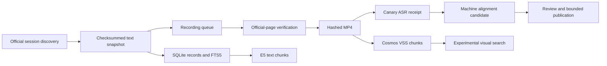

# Session, recording and GPU pipeline

This is the canonical operating guide for importing Swiss Parliament sessions and processing their public recordings. It is organized by stage rather than by the chronology of the hackathon.

Read [Architecture and data provenance](ARCHITECTURE.md) for component boundaries and [Current status](STATUS.md) for dated per-session counts.

## Archive-wide text import

Declare and reconcile the official session boundary before running individual workers:

```powershell
npm run archive:discover -- --from-year=1990 --to-year=2026
npm run archive:import:text -- --dry-run --limit=5
npm run archive:import:text -- --limit=5
```

`archive:discover` writes ignored local artifacts at `data/parliament/archive-manifest.json` and `data/parliament/archive-text-queue.json`. The manifest reports text, media, ASR, embedding and alignment stages separately. `archive:import:text` invokes the existing checksum-backed session importer sequentially, writes `data/parliament/archive-import-run.json` and continues past a failed session. Omit `--limit` only when the operator intends to process the complete declared queue; historical media remains a separate GPU and human-review programme.

After importing sessions, consolidate their recording work and export every public passage awaiting E5 processing:

```powershell
npm run processing:backlog
npm run embeddings:export
```

The processing command merges all `session-*/media-jobs.json` files into the provenance allowlist consumed by the receipt importer. It reconciles already imported Canary receipts from `public-processing.sqlite`, rejects source/session conflicts, preserves prior worker metadata when the session record does not replace it, and writes both a hashed aggregate manifest and `public-session-pending.json` for the H100 worker. The embedding export contains public parliamentary passages only; no conversation, account or profile-preference data is included.

Prepare a self-verifying public-only H100 handoff after both backlogs are current:

```powershell
npm run gpu:handoff
```

The ignored `artifacts/gpu-handoff/` directory contains the pending Canary queue, complete public E5 input, pinned worker scripts, SHA-256 manifest, a Python verifier and exact worker commands. It intentionally contains no `.env`, provider credentials, account database, conversations, feedback or private profile preferences. Upload and start it only through the existing restricted GPU transport.

## Pipeline states



Each state is independent. In particular, `queued`, `downloaded`, `ASR complete`, `machine aligned`, `VSS complete` and `human reviewed` are not interchangeable.

## 1. Import official session text

Run:

```bash
node scripts/ingest-session.mjs --session=5215
```

`scripts/ingest-session.mjs` queries the Swiss Parliament OData `Session`, `Meeting`, `Transcript`, `SubjectBusiness` and `Business` entities. Responses are stored under `data/parliament/session-<id>/responses/` with their URL, retrieval time and SHA-256 hash so interrupted pagination can resume safely.

The importer:

- keeps original speech language even though metadata is requested in French;
- indexes only `DisplaySpeaker === true` records with actual text;
- splits official Bulletin HTML into attributed paragraphs;
- retains all linked business IDs while exposing one primary ID for current scoped search;
- writes normalized records and revisions transactionally to `data/parliament.sqlite`;
- updates the FTS5 `speech_search` index;
- produces `progress.json` and `media-jobs.json`.

Reusing cached responses reproduces a frozen snapshot. It does not refresh an ongoing session. Use a separately versioned import/reconciliation process before treating a rerun as fresh published coverage.

## 2. Resolve and download official media

For a bounded pilot recording:

```bash
node scripts/prepare-session-media.mjs --session=5214 --transcript=374406
```

Without `--transcript`, the helper selects bounded DE/FR/IT samples. It fetches the official Bulletin page, extracts `OnDemandDownloadUrl`, requires HTTPS on `par-pcache.simplex.tv`, checks content type and size, writes `data/media/parliament-<id>.mp4`, and stores the media hash back in the session manifest.

The full worker in the next stage also downloads missing queue media with disk-reserve and per-recording limits. Never construct or accept an arbitrary client-supplied media URL.

## 3. Run Canary ASR

The current resumable full-session worker is:

```bash
CUDA_VISIBLE_DEVICES=1 python scripts/process-public-sessions.py data/public-session-queue.json
```

Run it in the prepared NVIDIA environment from `/home/nvidia/swiss-parliament-intelligence`. It:

- keeps a SQLite job ledger so completed work can resume;
- verifies official source scope and downloads missing media;
- hashes every recording;
- uses `ffprobe` for duration and `ffmpeg` for bounded mono 16 kHz audio;
- transcribes 300-second windows with `nvidia/canary-1b-v2`;
- shifts word timings back to the original recording timeline;
- writes complete JSON receipts under `session-output/`;
- records failures explicitly rather than silently skipping them.

`scripts/canary-session-batch.py` is the earlier explicit-manifest pilot helper. `scripts/session-asr-batch.py` and the retained Parakeet receipts document the earlier bounded experiment; Parakeet is not the current bulk worker.

## 4. Import and validate ASR receipts

After copying a public-only receipt checkpoint back to the application host, run:

```bash
node scripts/import-public-processing.mjs data/gpu-processing/session-output
```

For growing batches, snapshot completed atomic receipts into one compressed archive on the GPU host, record its SHA-256, transfer that single file, verify the local hash, and only then extract and import it. This avoids repeatedly transferring hundreds of individual JSON files through the LaunchPad gateway while preserving an immutable checkpoint boundary. The archive must contain only `*-canary.json` receipts; do not include credentials, media, account data or a live SQLite file.

Current measured state: 121 of 185 declared sessions are text-complete, yielding 1,041,964 public passages and 205,797 recording jobs. The local ledger knows 5,618 jobs complete and 200,179 pending. The `receipts-20260922-194100.tar.gz` checkpoint had SHA-256 `a8ac7b3b9265b9f9df32179dda01ce6cccec4500d35f637921dfc19f3d5f4095`; 2,280 receipts passed validation and six empty/no-speech receipts were rejected. Across the consolidated 5,607 validated receipts, staging produced 7,988 machine alignment candidates for 2,919 recordings. These candidates are not human-reviewed quotations.

The importer accepts a receipt only when its transcript ID exists in `data/public-session-queue.json` and its official page, session, language, model, duration and media hash satisfy the expected contract. Accepted receipts go to `data/public-processing.sqlite`.

This consolidated database is newer and broader than the small per-session pilot manifests. Do not add those two counters together. See [Status](STATUS.md#why-some-counts-differ-from-old-notes).

## 5. Align machine words to official text

Run:

```bash
node scripts/stage-public-alignments.mjs
```

The aligner compares Canary word sequences with official Bulletin paragraphs and writes `data/alignment-review/candidates.json`. It uses ordered anchors, overlap thresholds, source identity and timing bounds. Candidates remain machine-generated even when the match score is high.

Only reviewed, explicitly published alignments belong in the application alignment file. Until a human review workflow records acceptance, label playback as machine-aligned and keep a full-intervention or official-source fallback.

## 6. Generate and preserve VSS embeddings

VSS is a separate experimental visual path:

1. `scripts/pilot-rtvi-compose.yml` runs `vss-rt-embed:3.2.1` with `cosmos-embed1-448p`.
2. `scripts/connect-vss-embed.py` connects the existing VSS agent to the loopback embedding service.
3. `scripts/process-vss-video.py <transcript-id>` uploads an already verified official MP4 and records the processing receipt.
4. `scripts/preserve-vss-embeddings.py` saves the full vectors because the completion response exposes counts only.
5. `node scripts/import-vss-receipts.mjs` validates receipt count, model and media hash against the session manifest.
6. `server/video-search.mjs` embeds a text query through the private VSS endpoint and ranks retained chunks.

Kafka is disabled in this pilot; there is no external persistent VSS index. The retained visual index is built from verified local receipts. Scores are similarity values, not confidence or evidence that words were spoken.

## 7. Generate public text embeddings

Prepare public-only input:

```bash
node scripts/export-public-embedding-input.mjs
```

The exporter iterates SQLite rows and streams ordered JSONL through backpressure into a temporary file, then atomically renames it after completion. It must not assemble the full corpus as one JavaScript string: the archive exceeds V8's maximum string length well before the declared session range is complete.

On the GPU host:

```bash
CUDA_VISIBLE_DEVICES=1 python scripts/embed-public-corpus.py data/public-embedding-input.jsonl data/public-embeddings.sqlite
```

Validate after copying the vector database back:

```bash
node scripts/validate-public-embeddings.mjs
```

The batch uses `intfloat/multilingual-e5-large`, pinned to revision `3d7cfbdacd47fdda877c5cd8a79fbcc4f2a574f3`, with normalized 1,024-dimensional vectors. Validation checks model/revision, source hashes, finite normalized vectors, chunk boundaries and complete imported-passage coverage.

The validated E5 database is not yet wired into production retrieval. The application continues to use FTS5 plus multilingual query expansion until vector retrieval and reranking pass an adjudicated comparison.

## 8. Translation and generated answers

Translation is not ASR. `scripts/translation-server.py` runs `nvidia/Riva-Translate-4B-Instruct-v2` behind the private `TRANSLATION_BASE_URL`. `POST /api/parliament/translate` accepts an existing evidence ID, preserves the original/source link, caches by source hash and target language, and rejects several language/number failures.

Generated answers are also downstream of retrieval, not part of media ingestion. `POST /api/parliament/ask` enters through `server/index.mjs`; `server/parliament-ai.mjs` selects evidence; `server/research.mjs` sends the `/chat/completions` request to Nemotron.

## 9. Validate and publish

Before publishing a new snapshot:

```bash
npm run docs:status
npm run docs:check
npm test
npm run test:api --prefix frontend
npm run test:sites --prefix frontend
npm run build --prefix frontend
```

Also verify:

- imported counts and source hashes match the intended snapshot;
- a refreshed ongoing session is labelled with its actual retrieval date;
- unavailable media and worker failures remain visible;
- no private account/session/feedback data enters a public package;
- machine timings and visual matches carry their review-state disclosures;
- production can still serve original text if GPU services are unavailable.

Publication packages are prepared and validated through the scripts documented in [Operations](OPERATIONS.md). A successful batch measurement is not a latency guarantee or a claim of complete archive coverage.
