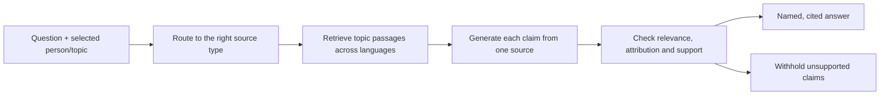

# Cleisthenes: evidence and answer workflow

> Historical validation checkpoint. Preserved for measured evidence; use [architecture](../../ARCHITECTURE.md), [status](../../STATUS.md) and the [session pipeline](../../SESSION-PIPELINE.md) for current behavior.

Implemented 18 September 2026. Policy version: `civic-evidence-v2`.



## What now runs

1. **Source routing.** Profile facts, party self-descriptions, speech and voting history stay distinct. Missing party material does not fall back to unrelated speeches. New party pages remain in staging until extraction review.
2. **Retrieval.** English questions generate French/German/Italian topic terms. Generic institution names are removed: searching for data protection should not retrieve a speech merely because it mentions Parliament. The live path still uses lexical search and query expansion, not the offline embedding index.
3. **Source-isolated generation.** Each model call sees one record, its source type, speaker, role and date. A concise, versioned system policy tells Cleisthenes to answer only the relevant part, retain conditions and uncertainty, distinguish stages, and name the speaker. No invented quotation: the original wording is attached server-side.
4. **Review.** A second model call checks each claim against its source, question and attribution metadata. It rejects irrelevant answers, lost negation, invented authorship, unsupported party-wide claims and historical statements presented as current. Profile and party answers now receive this review as well as speeches. A deterministic speech guard additionally blocks the observed “Parliament supports…” error.
5. **Delivery.** Only surviving claims appear with citations. Unsupported questions return insufficient evidence. Provider errors remain errors. Cache keys include the policy version and evidence revision.

The policy is in `server/answer-policy.mjs`; generation in `server/research.mjs`; verification in `server/claim-review.mjs`. This is a bounded workflow, not an autonomous research agent or a guarantee of truth. The reviewer uses the same model and can make correlated errors. Exact quotation matching proves provenance, not semantic entailment.

## Validation and known limits

- 69 backend tests passed, including source-role propagation, institution-keyword filtering, origin protection and collective-attribution regressions.
- A live 20-case synthetic review suite checks attribution, committee roles, negation, conditional support, party/member distinctions, procedural stage, historical context, irrelevant facts and instructions embedded in source text. Final result: 20/20. These fixtures never enter the public corpus.
- The original procedural-stage fixture was rejected in the first run (19/20). Its question/claim was clarified to explicitly refer to the historical record rather than a possibly current stage. The earlier result is retained in `artifacts/answer-accuracy-before-stage-clarification.json`; this is not evidence that every ambiguous temporal question is solved.
- Four real session checks passed: English answers grounded in DE/FR/IT passages and one unsupported question. Supported cases took approximately 7.9–8.5 seconds in that run.
- HTTP checks passed for broad English/French data-protection questions, cached repetition and an unsupported question. Fresh English: 5.8 s; French: 8.6 s; cached: 0.7 s. Small smoke timings, not a service guarantee.
- Trace inspection confirms the unrelated speaking-time passage disappeared and surviving answers named the actual speakers. Broad summaries still need contextual review; a short isolated paragraph may leave “this proposal” unresolved.

During development, a regex-constrained generation schema triggered an inference engine error. The constraint was removed and the pilot inference container restarted. Successful live evaluations confirmed recovery. VSS, translation and the ASR worker were not restarted. The final code uses the previously supported JSON schema format without that constraint.

Reproduce:

```powershell
npm test
node --env-file=.env scripts/evaluate-answer-accuracy.mjs
node --env-file=.env scripts/evaluate-session.mjs
node scripts/evaluate-request-path.mjs
```

## Evidence processing completed this turn

Copied a public-only snapshot of H100 ASR receipts and imported **969 recordings** into `data/public-processing.sqlite`. Import checks queue identity, official URL, session, language, model, hash format and timing bounds. It does not independently rehash remote media that is not downloaded locally.

Generated **1,460 machine timing candidates across 502 recordings** using official text and ASR word anchors. They are in `data/alignment-review/candidates.json`. They are not published video links and are not human-reviewed timings. Ten older receipts without the newer provenance fields were excluded from this snapshot. Seven worker failures were official recording URLs returning HTTP 404; their details remain in the snapshot report.

Next gates: review a representative timing sample against original video; expand the six-party staging corpus with comparable dated documents; freeze a larger multilingual retrieval benchmark and compare lexical versus hybrid retrieval before enabling vectors in live answers. Sign-in activation remains deferred until the user is available.
