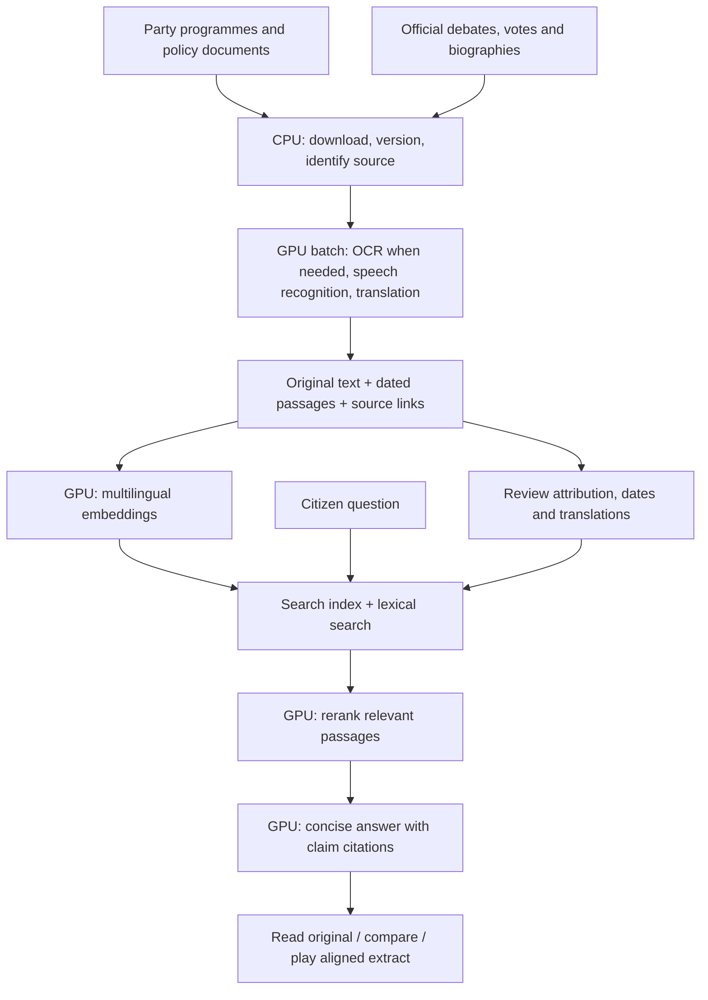

# H100s: next workloads

> Historical workload plan. Preserved for decision provenance; use [status](../../STATUS.md), the [session pipeline](../../SESSION-PIPELINE.md) and [operations](../../OPERATIONS.md).

18 September 2026. This is a proposed allocation, not a deployment claim.

Execution has started: see [the verified progress update](H100-EXECUTION-2026-09-18.md) for the repaired request path, current worker progress and first party embedding batch. The snapshot below predates that inspection.

## What is running

A read-only SSH check found two H100 NVL GPUs, each reporting 95,830 MiB memory. GPU 0 had 85,779 MiB allocated (about 84 GiB); GPU 1 had 36,695 MiB (about 36 GiB). Instantaneous utilization was 0% and 25%. Allocated memory remains occupied even when utilization is low. Do not start another large model based on utilization alone.

Running containers included Nemotron Nano 9B v2, VSS agent, RTVI embedding and VSS supporting services. Container health does not prove application availability: the browser chat failed to reach its model during today's UX review.

Local session manifests contain 3,346 job entries, 11 marked ASR-complete and nine marked VSS-complete. These are pipeline job counts, not unique full sessions or human-reviewed passages. The reviewed party catalog currently contains one SP/PS self-description; comprehensive party coverage is still work to do.

## Where computation creates value

| Order | Workload | User benefit | Completion gate |
|---|---|---|---|
| 1 | Restore and measure browser → API → model | Questions reliably receive an answer or a useful source fallback | Repeated supported questions; record failures, time to first feedback and full answer latency |
| 2 | Party-document pilot: about 30 documents across six major parties | Ask what a party says about an issue, with dated sources | All documents have canonical URL, publisher, date, language, hash and source type; reviewed sample from every party |
| 3 | Multilingual embeddings plus reranking | French questions find relevant German or Italian passages | Compare against current retrieval on a frozen multilingual question set; measure recall and added latency |
| 4 | ASR and alignment batches for selected debates | Read a debate, then listen to its exact words | Unique text anchors, bounded timestamps and timing review; never label an entire archive processed |
| 5 | Translation cache and Swiss terminology glossary | Consistent translations without repeated waiting | Original always accessible; model/version and review state retained; human review of names, negations and legal terms |
| 6 | Citation and attribution evaluation | Fewer fluent but unsupported answers | Supported/unsupported tests, wrong-speaker checks, source freshness and quoted-span verification |

NVIDIA provides separate [embedding](https://docs.nvidia.com/nim/nemo-retriever/text-embedding/latest/overview.html) and [reranking](https://docs.nvidia.com/nim/nemo-retriever/text-reranking/latest/overview.html) services. Model choice and memory requirements must be checked before installation; published benchmarks are not measurements of this pilot.

## Party pipeline: repeatable, not hand-written profiles

Start with SVP/UDC, SP/PS, FDP/PLR, The Centre/Le Centre, Greens/Les Verts and GLP/PVL. Inventory their official programmes and topic pages, then import a small balanced sample. This is a starting collection, not a definition of all Swiss parties.

Each document keeps publisher, canonical URL, retrieval time, publication date (or explicitly unknown), language, document version/hash and original text. Chunk by headings and paragraphs, retaining page or section anchors. Link translations to their original chunks. Deduplicate mirrored language versions without erasing their language provenance.

Keep four distinct evidence types: party self-description, parliamentary group position, individual speech and recorded vote. A party programme is evidence of what the party states, not proof of what every member believes or how they voted. Do not infer ideology, motives or changes of stance. Show disagreement and time context using citations.

A reusable import manifest, idempotent jobs and resumable failures make the process replicable. Refresh changed documents incrementally. Hold extracted summaries for review before publishing them as profile facts.

## Capacity and scheduling

Preserve the interactive answering service. Schedule one heavy batch at a time on the less occupied GPU after measuring free memory and the existing embedding workload. Downloads, vote imports, metadata, hashing, SQLite and export belong on CPU. Queue work with retry limits and checkpoint raw provider outputs; pause batches if interactive latency deteriorates.

Do not fine-tune first. Better retrieval, coverage and source attribution address the observed problems more directly. Voice can later use the same grounded answer service with ElevenLabs speech input/output; the subscription's API entitlements and quotas still need verification. No need to duplicate that stack on the H100s initially.

Suggested next implementation: repair the live request path, freeze 30 multilingual retrieval questions, import the first balanced party corpus, then benchmark embeddings/reranking before expanding. None of these new workloads was deployed as part of this overview.
